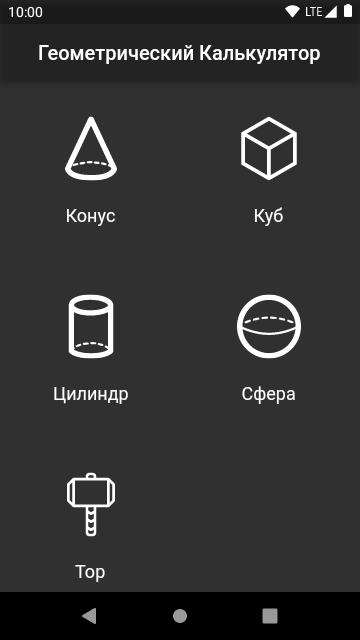
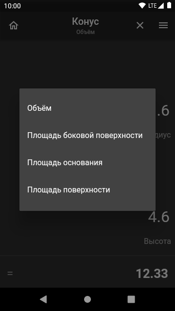
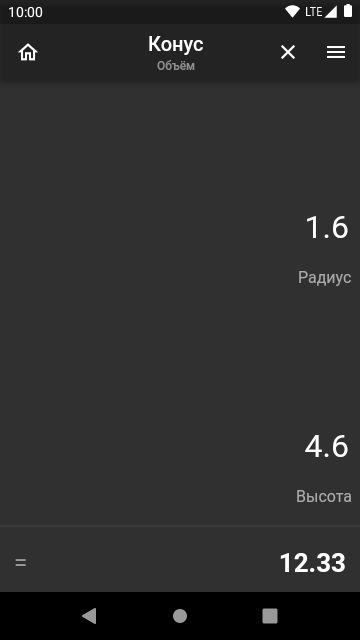

# Геометрический калькулятор

Быстрый, минималистичный калькулятор, для расчёта параметров геометрических тел.

## Скриншоты

  

## Установка

Для установки скачайте apk последнего [релиза приложения](https://github.com/sqxx/geometry_calc/releases) и установите его стандартными средствами Android.

## Сборка

Для сборки потребуется последняя версия [Flutter](https://flutter.dev/), [Android Studio](https://developer.android.com/studio) и установленный [плагин](https://plugins.jetbrains.com/plugin/9212-flutter) для Android Studio.

Для сборки финального apk требуется создать собственный ключ, файл key.properties. Подробно действия для сборки финального apk описаны [здесь](https://www.diera.ru/blog/publishing-flutter-app-to-play-store/).
